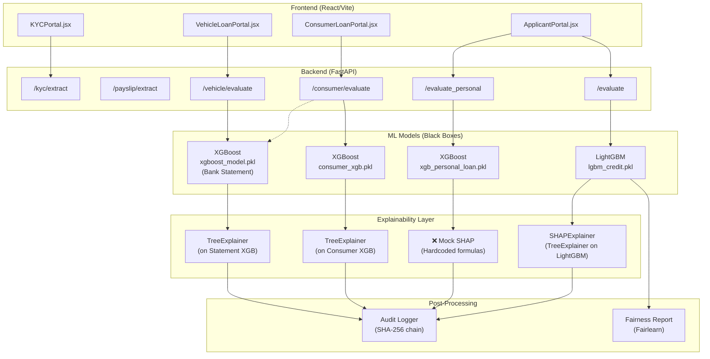

# 🔍 Credit System — Loan Pipeline Technical Analysis

## Overview

Your system supports **4 loan types**, each going through a different technical pipeline. Below is a deep-dive into what each one does, whether it uses a true black-box model, and whether SHAP explainability is genuinely implemented.

---

## 🏗️ Architecture Summary



---

## 📋 Loan-by-Loan Breakdown

### 1️⃣ General Loan (`POST /evaluate`)

| Stage | Technology | Details |
|-------|-----------|---------|
| **Pre-check** | KYC OCR (EasyOCR + PyMuPDF) | Aadhaar + PAN extraction, cross-verification |
| **Input** | 30+ structured features | CIBIL, DTI, income, employment, banking, etc. |
| **Model** | **LightGBM** (`lgbm_credit.pkl`) | 800 estimators, `max_depth=6`, `scale_pos_weight` for imbalance |
| **Training Data** | `synthetic_credit_dataset.csv` | Synthetic dataset with `loan_approved` target |
| **Threshold** | Optimal F1 threshold from PR curve | Stored in `model_meta.json` |
| **SHAP** | ✅ **REAL** — `shap.TreeExplainer` | Full computation via `SHAPExplainer` class |
| **Explanation** | Top-10 SHAP factors + plain-language messages | Per-feature human-readable reasons |
| **Audit** | SHA-256 hash-chained JSONL | Tamper-evident, includes inputs + SHAP + decision |
| **Fairness** | Fairlearn (Demographic Parity, Equalized Odds, 4/5ths Rule) | On gender, city_tier, age_group |

> [!TIP]
> This is the **most complete pipeline** — true black-box model + genuine SHAP + fairness + audit. This is proper Explainable AI.

**Process Flow:**
```
Applicant Data (30+ features)
    → LightGBM.predict_proba()           # Black-box prediction
    → SHAP TreeExplainer.shap_values()   # Post-hoc explanation
    → generate_applicant_message()       # Human-readable reasons
    → log_decision() with hash chain     # Immutable audit trail
    → Return: decision + probability + confidence + SHAP factors + message
```

---

### 2️⃣ Personal Loan (`POST /evaluate_personal`)

| Stage | Technology | Details |
|-------|-----------|---------|
| **Pre-check** | Payslip OCR (EasyOCR) | Extracts salary + company name from payslip image |
| **Input** | 4 features only | `cibil_score`, `monthly_salary`, `company_tier`, `loan_amount` |
| **Model** | **XGBoost** (`xgb_personal_loan.pkl`) | 100 estimators, `max_depth=4` |
| **Training Data** | Synthetic (3000 rows, rule-based generation) | Generated in `train_personal_loan.py` |
| **Threshold** | Hardcoded `0.5` | Not optimized |
| **SHAP** | ❌ **FAKE** — Hardcoded linear formulas | See code below |
| **Explanation** | Basic approve/reject message | Minimal, not data-driven |
| **Audit** | ✅ SHA-256 hash chain | Same audit system |

> [!CAUTION]
> **SHAP is NOT real here!** The code at [main.py:696-701](file:///d:/savee/credit_system/api/main.py#L696-L701) uses hardcoded formulas instead of actual SHAP computation:
> ```python
> shap_factors = [
>     {"feature": "cibil_score", "shap_value": float(application.cibil_score - 700) * 0.005},
>     {"feature": "monthly_salary", "shap_value": float(application.monthly_salary - 50000) * 0.00001},
>     {"feature": "company_tier", "shap_value": float(2 - application.company_tier) * 0.1},
>     {"feature": "loan_amount", "shap_value": float(500000 - application.loan_amount) * 0.000001}
> ]
> ```
> These are **not** model-derived explanations — they are manually computed linear offsets that **don't reflect the actual model's reasoning**.

---

### 3️⃣ Consumer Loan (`POST /consumer/evaluate`)

| Stage | Technology | Details |
|-------|-----------|---------|
| **Pre-check** | Bank statement parsing | PDF/Image OCR or CSV upload |
| **Input** | ~19 features | Combined from form inputs + bank statement extracted features |
| **Model (Statement)** | **XGBoost** (`xgboost_model.pkl`) | Bank statement risk classifier |
| **Model (Decision)** | **XGBoost** (`consumer_xgb.pkl`) | Final loan decision model |
| **Training Data** | Generated via `generate_consumer_dataset.py` | Custom consumer dataset |
| **Threshold** | From `consumer_xgb_meta.json` | Optimized threshold |
| **SHAP** | ✅ **REAL** — `shap.TreeExplainer` on Consumer XGB | Via `_build_shap_factors()` |
| **Explanation** | Top-6 SHAP factors with labels | Feature names + raw values |
| **Audit** | ✅ SHA-256 hash chain | Includes statement features + signals |

**Process Flow:**
```
Form Data + Bank Statement Upload
    → Parse bank statement (PDF/Image/CSV)
    → Extract 17 transaction features (overdrafts, spending, balance, etc.)
    → Classify statement via XGBoost (statement model)
    → Combine form + statement features
    → Consumer XGBoost.predict_proba()        # Black-box #2
    → SHAP TreeExplainer.shap_values()        # Real SHAP
    → log_decision() with hash chain
    → Return: decision + score + CIBIL normalized + SHAP factors
```

> [!NOTE]
> This pipeline uses **two black-box models in series** — one for bank statement risk scoring and one for the final loan decision. SHAP is applied to the final decision model only.

---

### 4️⃣ Vehicle Loan (`POST /vehicle/evaluate`)

| Stage | Technology | Details |
|-------|-----------|---------|
| **Pre-check** | Bank statement parsing | PDF/Image OCR via `credit_scoring` pipeline |
| **Input** | 17 engineered features | Extracted from bank statement text |
| **Model** | **XGBoost** (`xgboost_model.pkl`) | Same bank statement model as consumer |
| **Scoring** | Hybrid: ML probability (70%) + Rule-based risk (30%) | Not purely ML |
| **Threshold** | `final_score >= 70` → APPROVED, `>= 40` → MANUAL_REVIEW, else → REJECTED | Three-tier decision |
| **SHAP** | ✅ **REAL** — `shap.TreeExplainer` on Statement XGB | Via `_build_shap_factors()` |
| **Explanation** | Top-6 SHAP factors | On statement features |
| **Audit** | ✅ SHA-256 hash chain | Includes signals + statement features |

**Process Flow:**
```
CIBIL Score + Income + Bank Statement Upload
    → OCR extract text from statement
    → Parse transactions → Engineer 17 features
    → XGBoost.predict_proba()                  # Black-box (statement)
    → Rule-based risk scoring (salary, fraud, balance, volume)
    → Blend: 70% ML + 30% rules = final_score
    → SHAP TreeExplainer on statement features  # Real SHAP
    → Three-tier decision (APPROVED / MANUAL_REVIEW / REJECTED)
    → log_decision() with hash chain
```

> [!IMPORTANT]
> Vehicle loan uses a **hybrid scoring model** — not a pure black box. The final score is a weighted blend of ML prediction and handcrafted rules. SHAP only explains the ML component, not the rule-based portion.

---

## 🧠 Black-Box + SHAP Summary Table

| Loan Type | Black-Box Model | Algorithm | SHAP Implementation | Verdict |
|-----------|----------------|-----------|---------------------|---------|
| **General** | `lgbm_credit.pkl` | LightGBM | ✅ **Real** `TreeExplainer` | ✅ **True XAI** |
| **Personal** | `xgb_personal_loan.pkl` | XGBoost | ❌ **Fake** (hardcoded formulas) | ⚠️ **Broken XAI** |
| **Consumer** | `consumer_xgb.pkl` + `xgboost_model.pkl` | XGBoost × 2 | ✅ **Real** `TreeExplainer` | ✅ **True XAI** |
| **Vehicle** | `xgboost_model.pkl` | XGBoost + Rules | ✅ **Real** `TreeExplainer` (partial) | ⚠️ **Partial XAI** |

---

## 🔴 Critical Issues Found

### Issue 1: Personal Loan has FAKE SHAP
**File:** [main.py:695-701](file:///d:/savee/credit_system/api/main.py#L695-L701)

The comment says `# Mock SHAP for now` — these are linear approximations that bear no relation to the XGBoost model's actual internal decision paths. This means:
- The explanation shown to the applicant is **misleading**
- The SHAP values in the audit log are **not reproducible** from the model
- This violates the explainable AI guarantee

**Fix needed:** Replace with actual `shap.TreeExplainer(_personal_model)` computation.

### Issue 2: Vehicle Loan SHAP is Partial
The SHAP explanation covers only the XGBoost statement model (70% weight), but the remaining 30% of the decision comes from rule-based risk signals (`salary_flag`, `fraud_risk`, `balance_score`, `transaction_volume`) which have **no SHAP attribution**.

### Issue 3: No SHAP on Statement Model in Consumer Pipeline
In the consumer pipeline, the bank statement model (`xgboost_model.pkl`) produces a probability that feeds into the consumer model, but SHAP is only run on the consumer model — not on the statement model. So the user doesn't get transparency into *why* the statement scored low/high.

---

## 🟢 What's Done Well

1. **Tamper-evident audit chain** — SHA-256 hash linking across all pipelines is robust
2. **Fairness monitoring** — Fairlearn integration with Demographic Parity, Equalized Odds, and EEOC 4/5ths Rule
3. **KYC cross-verification** — Aadhaar + PAN cross-matching with fuzzy name comparison
4. **General loan pipeline** — Properly implements the full black-box → SHAP → plain-language → audit flow
5. **Consumer loan dual-model** — Sophisticated two-stage ML pipeline with real SHAP
