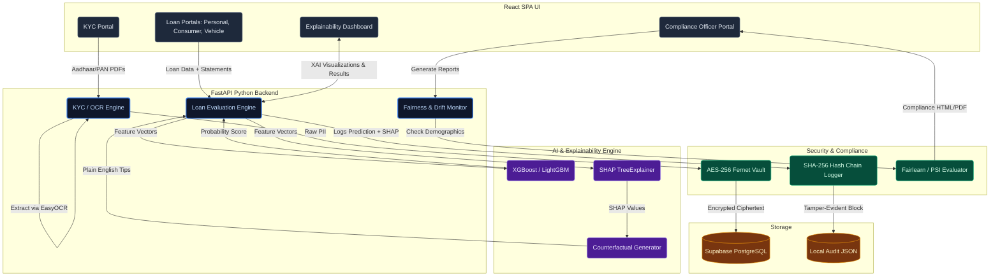

# CreditChecker: Complete System Architecture

CreditChecker is an enterprise-grade, regulatory-compliant AI credit decisioning platform. It bridges the gap between high-accuracy machine learning (XGBoost/LightGBM) and strict banking regulations by implementing an extensive **Explainable AI (XAI)**, **Tamper-Evident Auditing**, and **Zero-Knowledge Encryption** pipeline.

---

## 1. High-Level Architecture Diagram

---

## 2. Component Breakdown

### A. Frontend Layer (React + Vite)
The user interface is completely decoupled from the machine learning logic, focusing on state management and premium visualizations.
*   **KYC Portal:** Handles drag-and-drop ingestion of identity documents. It does *not* store PII in browser cookies or local storage.
*   **Specialized Loan Portals:** Separate workflows for Personal, Consumer, and Vehicle loans. They dynamically switch between "Lite Mode" (clean, text-based explanations) and "Pro Mode" (deep SHAP waterfall charts).
*   **Explainability Panel:** Renders SHAP data into dynamic SVG gauges, diverging bar charts, and human-readable counterfactuals (e.g., *"Reduce existing EMI to increase approval odds"*).
*   **Officer Dashboard:** A secure internal view for compliance officers to view recent decisions, verify hash-chain integrity, and export regulatory reports.

### B. API Layer (FastAPI)
Acts as the central nervous system, handling all HTTP requests, file uploads, and routing to the ML engines.
*   **OCR Pipelines (`kyc_extractor.py`, `payslip_extractor.py`):** Uses **EasyOCR** and **PyMuPDF** to automatically extract text from PDFs and images using regex and spatial bounding boxes.
*   **Evaluation Endpoints:** `/evaluate_personal`, `/consumer/evaluate`, etc., handle feature engineering (converting raw user inputs into structured pandas DataFrames).

### C. Machine Learning & Explainability (XAI)
The core predictive engine built to outperform traditional scorecards while remaining fully transparent.
*   **Predictive Models:** Utilizes heavily optimized **XGBoost** and LightGBM models trained on diverse datasets.
*   **SHAP Engine (`shap_explainer.py`):** Wraps the models in a `shap.TreeExplainer`. Instead of a black-box "Computer says no," it calculates exactly how much each feature (e.g., CIBIL score, Company Tier) pushed the probability up or down from the baseline expected value.
*   **Counterfactual Engine:** Translates raw SHAP outputs into actionable steps for rejected applicants, meeting modern "Right to Explanation" consumer protection laws.

### D. Zero-Knowledge Security Vault
The system guarantees that the cloud provider (Supabase) cannot read customer data.
*   **`secure_vault.py`:** Before any PII (Aadhaar/PAN data) leaves the server, it is encrypted using **Symmetric AES-256 (Fernet)**.
*   **Key Isolation:** The encryption key (`.vault_key`) is stored strictly on the local backend file system. The Supabase database only receives raw ciphertext.

### E. Regulatory Compliance & Tamper-Evident Auditing
Built specifically to pass RBI (India) and GDPR regulatory audits.
*   **Hash Chain Auditing (`audit_logger.py`):** Every AI decision is saved as a "block". Each block contains the cryptographic SHA-256 hash of the *previous* block. If anyone alters a past decision in the database, the entire chain breaks, proving tampering occurred.
*   **Fairness Testing (`fairness_report.py`):** Uses Microsoft's `fairlearn` library to evaluate the model against protected classes (e.g., Gender, Income Bands) to ensure **Demographic Parity** and **Equalized Odds**.
*   **Drift Detection (`drift_calculator.py`):** Calculates the **Population Stability Index (PSI)**. If the demographic of applicants today shifts drastically from the data the model was trained on, the system flags it to prevent degrading accuracy.

---

## 3. Data Flow: The Lifecycle of a Loan Application

1.  **Ingestion:** User uploads Aadhaar/PAN. The Frontend sends the files to the `/kyc/extract` API.
2.  **Extraction & Encryption:** FastAPI runs OCR, extracts text, encrypts the PII via the Vault, saves the ciphertext to Supabase, and returns a secure `session_id` to the frontend.
3.  **Application:** User fills out loan details (e.g., CIBIL, Salary) and uploads bank statements. Frontend sends this to `/consumer/evaluate`.
4.  **Inference:** FastAPI engineers the features and passes the array to XGBoost. XGBoost returns a probability (e.g., `74.3%`).
5.  **Explainability:** The same feature array is passed to the SHAP explainer, which breaks down the `74.3%` into constituent parts (+15% due to high salary, -2% due to dependents).
6.  **Auditing:** The input features, the probability, and the SHAP factors are hashed, linked to the previous transaction, and stored in the tamper-evident audit log.
7.  **Response:** The frontend receives the probability, the SHAP factors, and the generated plain-English tips, rendering the Explainability Panel.
